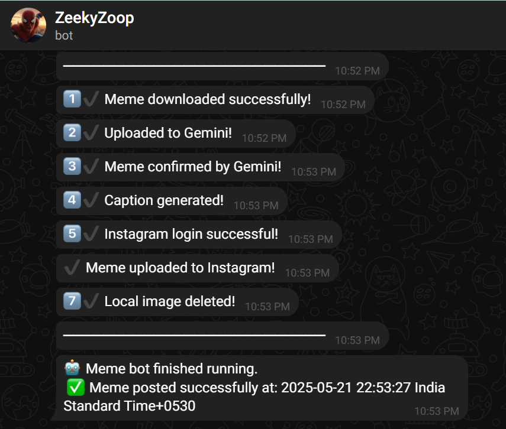
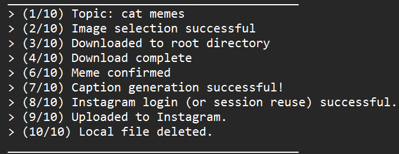
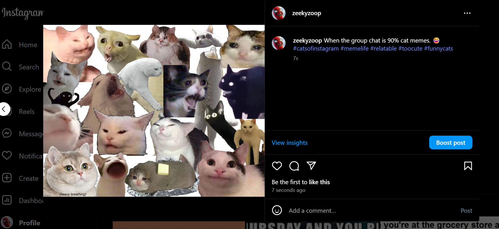

# 🤖 AI-powered Instagram Meme Posting Automation Bot

Check out [ZeekyZoop](https://www.instagram.com/zeekyzoop/) Instagram Page, it is a fully automated pipeline that:

1. **Discovers** trending memes via Google Custom Search (CSE)  
2. **Validates** the image quality and checks if it is a meme.
3. **Uploads** to Google Gemini (LLM) for caption generation.  
4. **Posts** to Instagram via `instagrapi` with session reuse and auto-relogin . 
5. **Quality-Controls** the entire run by sending real-time status updates to your custom **Telegram** bot.

---

## 🔗 Integrations & Architecture

- **Google CSE (Programmable Search)**  
  - Broad web search for PNG memes (or restrict to your favorite domains)  
- **Google Gemini (LLM API)**  
  - AI-driven captioning using a modern LLM, accessed via [Gemini API](https://ai.google.dev/aistudio). 
- **Instagram Automation**  
  - Logs in with a persistent session file, retries on `LoginRequired` exceptions  
- **Telegram Quality Control**  
  - Sends “✅ Success” or “❌ Failure” messages after each major step  
  - Acts as your observability dashboard, so you don’t have to check Instagram manually

---

## 🛡 Reliability & Fault Tolerance

Every external call is wrapped in:

- **Try/Except** blocks  
- **Retry logic** with **exponential backoff** for network blips.  
- **User-Agent spoofing** to avoid CDN blocks. 
- **Strict Boolean returns** (`True`/`False`) so the orchestrator knows exactly what happened.  

This ensures end-to-end stability and clear error reporting.

---
## 📸 Screenshots
1. **Telegram Notification**  
   

  ---
2. **Terminal Log**  
   

   ---
3. **Instagram Post**  
   

---
## ⚙️ Quickstart

1. **Clone** the repo  
   ```bash
   git clone https://github.com/your-username/auto-insta-meme.git
   cd auto-insta-meme
   ```

2. **Install** the Dependencies
```bash
pip install -r requirements.txt
```

3. **Configure** your credentials in src/config.py (or use .env + python-dotenv):
```bash
IG_USERNAME        = "your_instagram_username"
IG_PASSWORD        = "your_instagram_password"
GOOGLE_API_KEY     = "your_google_api_key"
CSE_ID             = "your_cse_engine_id"
GEMINI_API_KEY     = "your_gemini_api_key"
TELEGRAM_BOT_TOKEN = "your_telegram_bot_token"
TELEGRAM_CHAT_ID   = "your_telegram_chat_id"
DEBUG_MODE         = True  # Toggle verbose logging
```

4. **Run** the bot:
```bash
python src/bot.py
```

You’ll see logs for each step and get a Telegram message summarizing success or failure—your built-in Quality Control system.

---

## 📂 Project Structure
```bash
src/
├── bot.py              # Entry point & orchestration
├── config.py           # API keys & constants
├── google_search.py    # Meme discovery & download logic
├── gemini_client.py    # Upload & caption via LLM
├── ig_client.py        # Instagram session management & upload
└── notifier.py         # Telegram notifications (Quality Control)
README.md
requirements.txt
.env
```
---
This setup blends beginner-friendly instructions with critical technical terminology—so you understand both what happens and how it works under the hood. Feel free to fork, extend, or integrate additional modules (e.g., scheduler, analytics) as you scale your meme-posting operation.

---
